# Develop Enterprise-grade Hybrid Mobile App with Cloud-native Backend

When developing your enterprise mobile app that needs centralized hosting of data, use of cloud-native services such as [Cloudant No-SQL Database](https://www.ibm.com/cloud/cloudant) for storing textual data and [Object Storage service](https://www.ibm.com/cloud/object-storage) for storing image/video/audio data, allows you to quickly go from idea-conception to reality. The [Mobile Foundation service](https://www.ibm.com/cloud/mobile-foundation) available from IBM Cloud provides a scalable mobile access gateway for securely accessing those backend services, and it provides other essential mobile backend capabilities such as push notifications, app lifecycle management and app analytics.

This code pattern gives you step by step instructions for developing an [Ionic/Cordova](https://ionicframework.com/) based hybrid mobile app that securely connects to Cloudant and Object Storage services via IBM MobileFoundation (aka MFP) service.

When you have completed this pattern, you will understand:
* How to authenticate users (through preemptive login) using MFP security adapter.
* How to write an MFP adapter that authenticates with Cloud Object Storage service and pass back the Authorization token to the mobile app.
* Recommended architectural patterns for coding the interaction between mobile app and Cloud Object Storage service.
* How to use [`imgcache.js`](https://github.com/chrisben/imgcache.js/) in Ionic app for caching images fetched from Cloud Object Storage service.
* How to show Google Maps in Ionic app as well as capture user’s geo-location & image from camera.
* How to upload the captured image from mobile app to Cloud Object Storage service.
* How to fetch data from Cloudant service to mobile app via MFP adapter as well as post new data to Cloudant.
* How to customize the Ionic app logo and splash, and build the release apk for uploading to public/private app stores.

## Flow

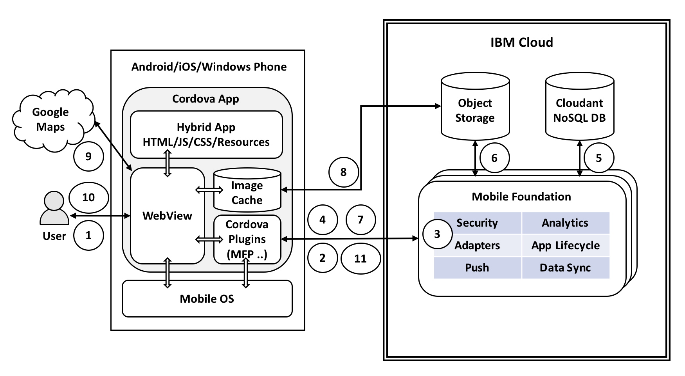

1. User launches the mobile app, enters his/her credentials on the login screen and clicks `Login`.
2. Mobile app sends the user credentials to MFP server for validation.
3. MFP server invokes the security adapter logic to validate user credentials and returns an appropriate response to the mobile app. For the sake of this demo, we will use a simple security adapter that returns success when password equals username.
4. If user authentication succeeds, mobile app proceeds to show the home page. As part of this, it makes a call to MFP adapter to fetch the data from Cloudant NoSQL database.
5. MFP adapter fetches the data from Cloudant and returns it to the mobile app. The data fetched from Cloudant will have references to the images stored in Cloud Object Storage.
6. Mobile app makes a call to MFP adapter to get the Authorization token for interacting with Cloud Object Storage service.
7. MFP adapter makes a call to Cloud Object Storage service's token manager endpoint to get the Authorization token
and returns it to the mobile app.
8. Mobile app initializes image-caching plugin and asks it to use an HTTP header of `Authorization=<value returned from MFP adapter>` while fetching images. Mobile app displays the data obtained from MFP adapter as a list of items. The image caching plugin running on the mobile app downloads and caches images from Cloud Object Storage.
9. User clicks on one of the list item to see more details. A detail page is shown consisting of image and geo-location marked inside Google Maps.
10. Back in the home page, user clicks on `+` button to report a new civic problem. A new page is shown where user can enter a description for the new civic problem as well as capture image and geo-location of the problem spot. User clicks on `Submit` button.
11. Mobile app uploads the textual data to Cloudant NoSQL DB via MFP Adapter.
12. Mobile app creates a thumbnail image by resizing the captured image and uploads both the captured image and thumbnail to Cloud Object Storage.
13. Other users who click on refresh button on the home page (and those who log in afresh) are shown the updated list of problem reports.

## Included Components
* [Cloudant NoSQL DB](https://cloud.ibm.com/catalog/services/cloudant): A fully managed data layer designed for modern web and mobile applications that leverages a flexible JSON schema.
* [Cloud Object Storage](https://cloud.ibm.com/catalog/services/cloud-object-storage): A highly scalable cloud storage service, designed for high durability, resiliency and security.
* [Mobile Foundation](https://cloud.ibm.com/catalog/services/mobile-foundation): A scalable mobile access gateway powered by the market-leading IBM Mobile Foundation Technology. The service offers a comprehensive set of mobile backend capabilities such as, App life cycle, Push, Analytics, Feature Toggle, Security and Authentication and offline synch.

## Featured Technologies
* [Mobile](https://mobilefirstplatform.ibmcloud.com/): Systems of engagement are increasingly using mobile technology as the platform for delivery.

# Watch the Video
[](https://youtu.be/SjM3aVRvGWQ)

# Steps
1. [Setup Ionic and MFP CLI](#step-1-setup-ionic-and-mfp-cli)
2. [Create Cloudant database and populate it with sample data](#step-2-create-cloudant-database-and-populate-it-with-sample-data)
  - 2.1 [Create Cloudant database](#21-create-cloudant-database)
  - 2.2 [Generate Cloudant API Key](#22-generate-cloudant-api-key)
3. [Create IBM Cloud Object Storage service and populate it with sample data](#step-3-create-ibm-cloud-object-storage-service-and-populate-it-with-sample-data)
  - 3.1 [Create IBM Cloud Object Storage](#31-create-ibm-cloud-object-storage)
  - 3.2 [Create Service ID and API Key for accessing objects](#32-create-service-id-and-api-key-for-accessing-objects)
4. [Create Mobile Foundation service and configure MFP CLI](#step-4-create-mobile-foundation-service-and-configure-mfp-cli)
5. [Download source repo and customize](#step-5-download-source-repo-and-customize)
  - 5.1 [Clone repo](#51-clone-repo)
  - 5.2 [Update App ID, Name and Description](#52-update-app-id-name-and-description)
  - 5.3 [Specify Cloudant credentials in MFP adapter](#53-specify-cloudant-credentials-in-mfp-adapter)
  - 5.4 [Specify Cloud Object Storage credentials in MFP Adapter](#54-specify-cloud-object-storage-credentials-in-mfp-adapter)
6. [Deploy the MFP Adapters and Test them](#step-6-deploy-the-mfp-adapters-and-test-them)
  - 6.1 [Build and Deploy the MFP adapters](#61-build-and-deploy-the-mfp-adapters)
  - 6.2 [Launch MFP dashboard and verify adapter configurations](#62-launch-mfp-dashboard-and-verify-adapter-configurations)
  - 6.3 [Test the MyWardData adapter](#63-test-the-mywarddata-adapter)
7. [Run application on Android phone](#step-7-run-application-on-android-phone)
  - 7.1 [Install Android Studio and Android SDK platform](#71-install-android-studio-and-android-sdk-platform)
  - 7.2 [Enable developer options and USB debugging on your Android phone](#72-enable-developer-options-and-usb-debugging-on-your-android-phone)
  - 7.3 [Setup API keys for using Google Maps](#73-setup-api-keys-for-using-google-maps)
  - 7.4 [Enable Android platform for Ionic application](#74-enable-android-platform-for-ionic-application)
  - 7.5 [Register the MyWard app to MFP server](#75-register-the-myward-app-to-mfp-server)
  - 7.6 [Build/Run the Ionic application on Android phone](#76-buildrun-the-ionic-application-on-android-phone)
  - 7.7 [Update App Logo and Splash](#77-update-app-logo-and-splash)
  - 7.8 [Build APK for uploading to Google Play Store](#78-build-apk-for-uploading-to-google-play-store)

[Troubleshooting](#troubleshooting)

## Step 1. Setup Ionic and MFP CLI
* Install `Node.js` by downloading the setup from https://nodejs.org/en/ (Node.js 8.x or above)
```
$ node --version
v8.6.0
```

* Install Cordova
```
$ sudo npm install -g cordova@7.0.1
$ cordova --version
7.0.1
```

**Note**: If you are on Windows, instead of using `sudo`, run the above command (and the ones below) in a command prompt opened in administrative mode.

> Note: Please refer MFP documentation for compatible versions of Cordova - https://mobilefirstplatform.ibmcloud.com/tutorials/en/foundation/8.0/application-development/sdk/cordova/

* Install Ionic
```
$ sudo npm install -g ionic@3.19.0
$ ionic --version
3.19.0
```

* Install IBM MobileFirst Platform CLI
```
$ sudo npm install -g mfpdev-cli
$ mfpdev --version
8.0.0-2017091111
```

  Note: While installing MFP CLI, if you hit an error saying `npm ERR! package.json npm can't find a package.json file in your current directory.`, then it is most likely due to [MFP CLI not being supported in your npm version](https://stackoverflow.com/questions/46168090/ibm-mobile-first-mfpdev-cli-installation-failure). In such a case, downgrade your npm as below, and then install MFP CLI.
  ```
  $ sudo npm install -g npm@3.10.10
  ```

* Install GIT https://git-scm.com/downloads
```
$ git --version
git version 2.9.3 ...
```

* Install Maven:
On Mac, you can use `brew install` for installing Maven as shown below:
```
$ /usr/bin/ruby -e "$(curl -fsSL https://raw.githubusercontent.com/Homebrew/install/master/install)"
$ brew install maven
$ mvn --version
Apache Maven 3.5.0 ...
```

* Install Java SDK from https://www.oracle.com/technetwork/java/javase/downloads/index.html
```
$ java -version
java version "1.8.0_101"
```

* Install an [IDE for TypeScript](https://www.typescriptlang.org/index.html#download-links) such as [Atom](https://atom.io/) on Mac.

  After installing [Atom](https://atom.io/), install TypeScript plugin for Atom as shown below.
```
apm install atom-typescript
```

## Step 2. Create Cloudant database and populate it with sample data

### 2.1 Create Cloudant database

* Log in to [IBM Cloud Dashboard](https://cloud.ibm.com/) and create [*Cloudant NoSQL DB*](https://cloud.ibm.com/catalog/services/cloudant) service.
* From the welcome page of Cloudant service that you just created, launch the Cloudant Dashboard.
* In the Cloudant Dashboard, click on `Databases`.
* Click on `Create Database`. Specify name of database as `myward` as shown below. Click `Create`.

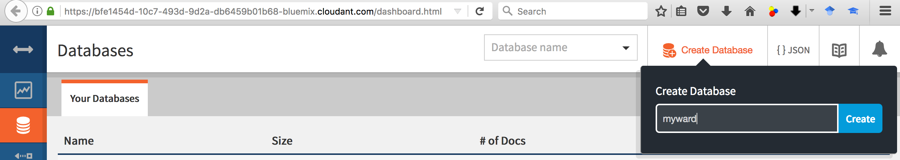

Once the database is created, the dashboard will update to show the documents inside `myward` database (which, as expected, will be empty to begin with).

* Click `Create Document`. Under document content, after the auto populated `_id` field, enter grievance details as shown below. Please note that you need to put a comma (,) after the auto populated `_id` field.

<pre><code>
{
  "_id": "7fc63023799dfda9582609e75127b4fa"<b>,
  "reportedBy": "shivahr@gmail.com",
  "reportedDateTime": "20171125_152627",
  "picture": {
    "large": "IMG-20171125-WA0012.jpeg",
    "thumbnail": "thumbnail_IMG-20171125-WA0012.jpg"
  },
  "problemDescription": "Car parking on busy market road chocking movement of other vehicles and pedestrians",
  "geoLocation": {
    "type": "Point",
    "coordinates": [
      77.7893168,
      13.0773568
    ]
  },
  "address": "Basaveshwara Temple road (behind Market Road), Hosakote, Bangalore 562114"</b>
}
</code></pre>

Click `Create Document` to create/save the document.

* Repeat the above steps and create documents for the remaining sample grievances: [SampleData/MyWardGrievance2.json](SampleData/MyWardGrievance2.json), [SampleData/MyWardGrievance3.json](SampleData/MyWardGrievance3.json), [SampleData/MyWardGrievance4.json](SampleData/MyWardGrievance4.json), [SampleData/MyWardGrievance5.json](SampleData/MyWardGrievance5.json), [SampleData/MyWardGrievance6.json](SampleData/MyWardGrievance6.json).

The `myward` database should now list the six documents as shown below under `Table` view.

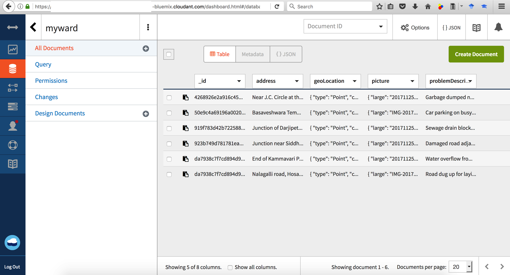

### 2.2 Generate Cloudant API Key

 * In the Cloudant Dashboard, under `myward` database, click on `Permissions` and then click on `Generate API Key` as shown in the snapshot below.
 * Make a note of the Key and Password generated.
 * The newly added key would get listed under Cloudant users with default permission of *reader* only. Select the checkbox under *writer* next to the new key to give it write permission as well.

  


## Step 3. Create IBM Cloud Object Storage service and populate it with sample data

### 3.1 Create IBM Cloud Object Storage

* In the [IBM Cloud Dashboard](https://cloud.ibm.com/), click on `Catalog` and select [*Object Storage*](https://cloud.ibm.com/catalog/services/cloud-object-storage) service under `Infrastructure` -> `Storage`. Click on `Create` as shown below.

  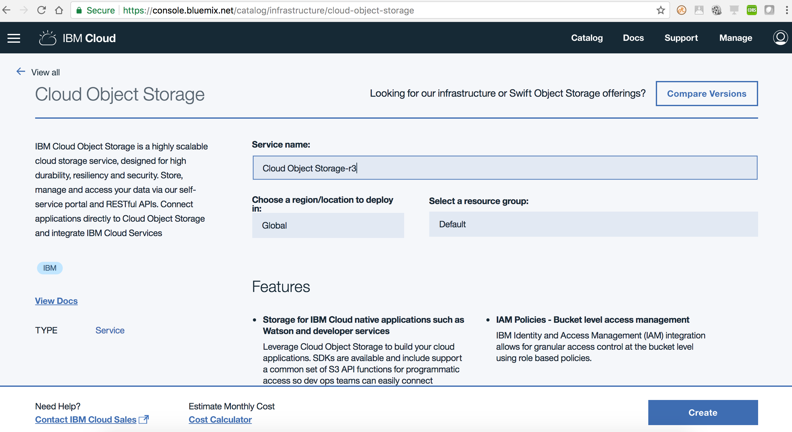

* The *IBM Cloud Object Storage* dashboard will get shown. In the `Buckets and objects` page, click on `Create bucket`. Give a unique name for the bucket. Leave the default selections as-is for *Resiliency* (`Cross Region`), *Location* (`us-geo`) and *Storage class* (`Standard`), and click on `Create` as shown below.

  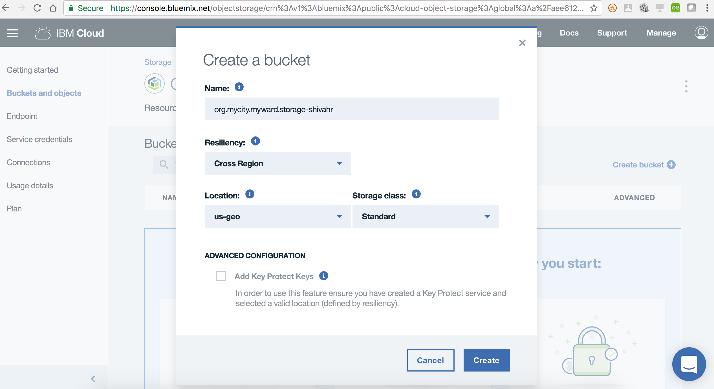

* The *Bucket overview* page for the newly created bucket will get shown. Click on `Add objects`. In `Upload obects` dialog, click on `Add files` and select all the images under [SampleData](SampleData) directory (the six images and their thumbnails). Click `Open`. Click on `Upload` as shown below. Once upload is complete, you should see the images listed under your bucket.

  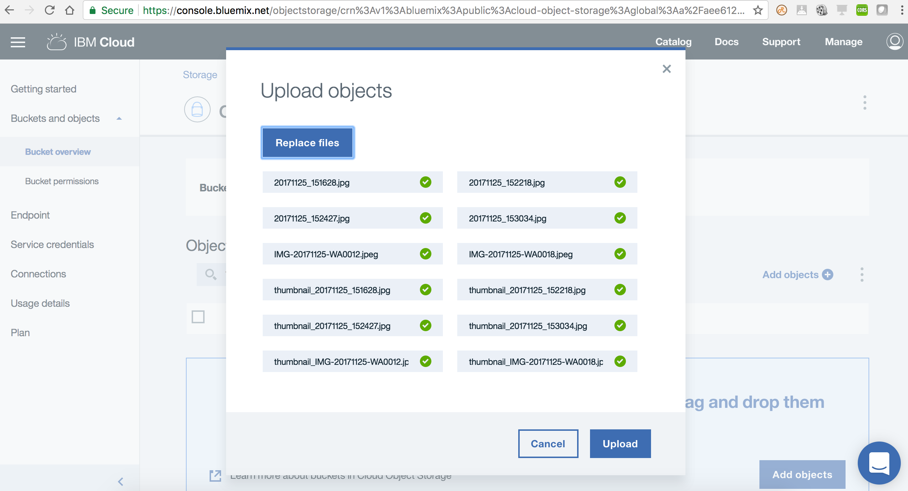

### 3.2 Create Service ID and API Key for accessing objects

* Create Service ID
  - In a separate browser tab/window, launch the *IBM Cloud Identity & Access Management* dashboard using URL https://cloud.ibm.com/iam/.
  - In case you have multiple IBM Cloud accounts, then select the target Account, Region, Organization and Space.
  - Under `Identity & Access` (on the left side of the page), select `Service IDs` and click `Create`. Give a name and description, and click `Create`.
  - Make a note of the Service ID as shown below.

  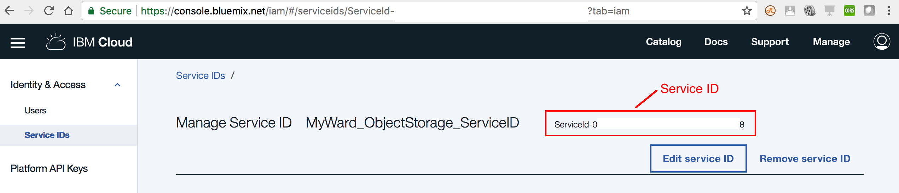

* Add Cloud Object Storage *Writer* role to that service ID
  - Back in *IBM Cloud Object Storage* dashboard, select `Bucket permissions` under `Buckets and objects`.
  - Click on `Service IDs` tab. Under `Select a service ID`, select the service ID created in the above step. Under `Assign a role to this service ID for this bucket`, select `Writer`. Click `Create policy` as shown below. You should get a confirmation dialog saying “Service permission created“.

  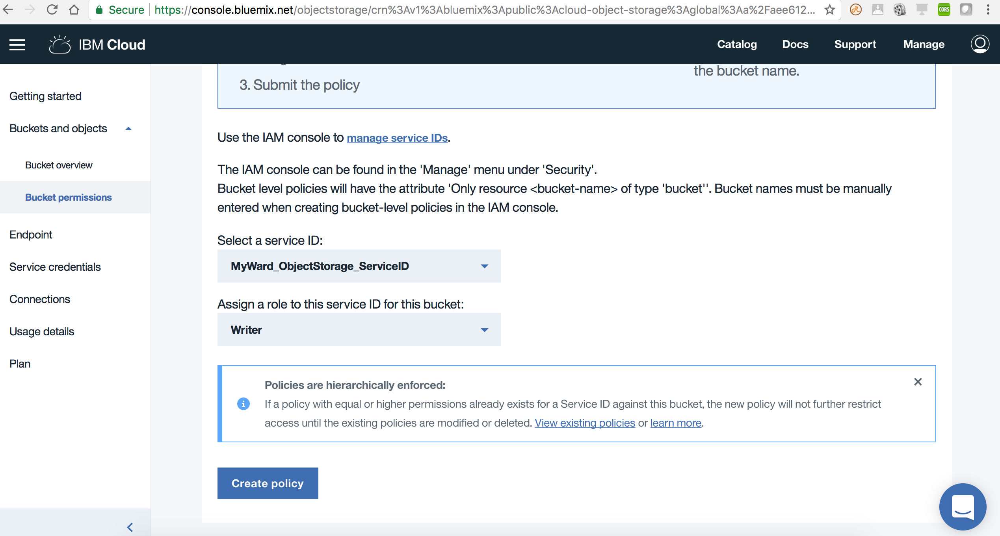

* Create API Key
  - Back in *IBM Cloud Identity & Access Management* dashboard, under `Service IDs`, click on the service ID created earlier.
Under `Access policies`, you should see the `Writer` role for your bucket.
  - Click on `API keys` tab and then click on `Create` button. In the `Create API key` dialog, give a name and description for the API key and click on `Create`. You should get a confirmation dialog saying `API key successfully created` as shown below.
  - Click on `Download` and save the API key as shown below. Note: This is the only time you will see the key. You cannot retrieve it later.
  - Finally click on `Close`.

  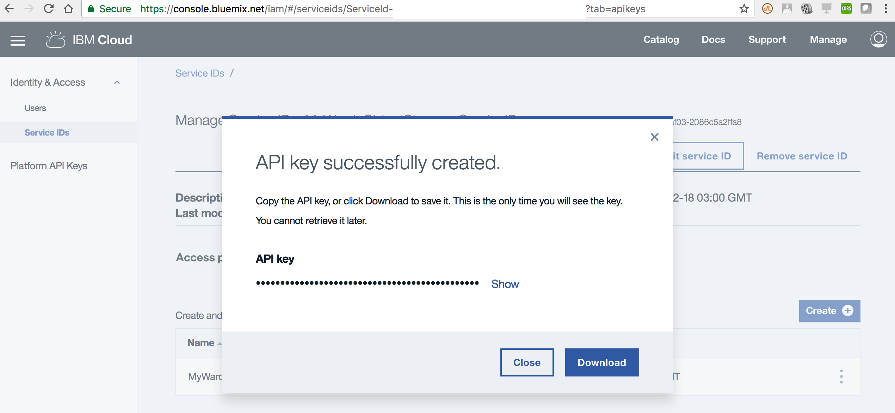


## Step 4. Create Mobile Foundation service and configure MFP CLI

* In the [IBM Cloud Dashboard](https://cloud.ibm.com/), click on `Catalog` and select [Mobile Foundation](https://cloud.ibm.com/catalog/services/mobile-foundation) service under `Platform` -> `Mobile`. Click on `Create` as shown below.

  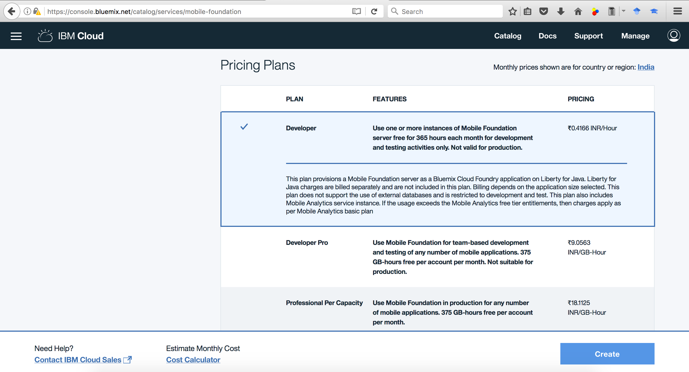

  Note: If *Mobile Foundation* service is not available with your current account type, then you can either:
  - Upgrade your account, and avail the *Mobile Foundation* service's free Developer plan which allows the use of the service free for up to ten daily client devices for development and testing activities, or
  - Start MobileFirst Server instance locally by downloading the [Developer Kit](https://mobilefirstplatform.ibmcloud.com/downloads/#developer-kit) and [installing](https://mobilefirstplatform.ibmcloud.com/tutorials/en/foundation/8.0/installation-configuration/development/mobilefirst/installation-guide/) it on your workstation.

* In the Mobile Foundation service overview page that gets shown, click on `Service credentials`. Expand `View credentials` and make a note of the `url`, `user` and `password` as shown below.

  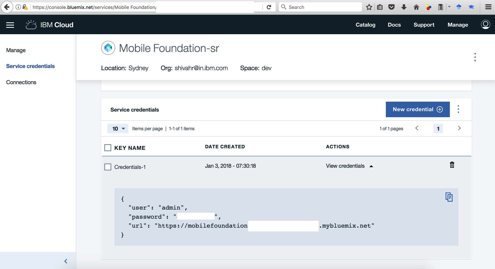

  Note: If you are using the MobileFirst Developer Kit, the default url would be http://localhost:9080 and username/password would be admin/admin .

* Back on your local machine, configure MFP CLI to work with Mobile Foundation server by running the following command in console.

  Note: For `Enter the fully qualified URL of this server:`, enter the `url` mentioned in credentials followed by `:443` (the default HTTPS port). If you are using the MobileFirst Developer Kit, then enter http://localhost:9080 .

```
$ mfpdev server add
? Enter the name of the new server profile: Cloud-MFP
? Enter the fully qualified URL of this server: https://mobilefoundation-71-hb-server.mybluemix.net:443
? Enter the MobileFirst Server administrator login ID: admin
? Enter the MobileFirst Server administrator password: **********
? Save the administrator password for this server?: Yes
? Enter the context root of the MobileFirst administration services: mfpadmin
? Enter the MobileFirst Server connection timeout in seconds: 30
? Make this server the default?: Yes
Verifying server configuration...
The following runtimes are currently installed on this server: mfp
Server profile 'Cloud-MFP' added successfully.

$ mfpdev server info
Name         URL
--------------------------------------------------------------------------------------
Cloud-MFP  https://mobilefoundation-71-hb-server.mybluemix.net:443        [Default]
--------------------------------------------------------------------------------------
```

## Step 5. Download source repo and customize

### 5.1 Clone repo

```
$ git clone https://github.com/IBM/Ionic-MFP-App
$ cd Ionic-MFP-App
```

### 5.2 Update App ID, Name and Description
Update `IonicMobileApp/config.xml` as below. Change `id`, `name`, `description` and `author` details appropriately.

<pre><code>
&lt;?xml version='1.0' encoding='utf-8'?&gt;
&lt;widget <b>id="org.mycity.myward"</b> version="0.0.1" xmlns="https://www.w3.org/ns/widgets" xmlns:cdv="http://cordova.apache.org/ns/1.0" xmlns:mfp="http://www.ibm.com/mobilefirst/cordova-plugin-mfp"&gt;
    <b>&lt;name&gt;MyWard&lt;/name&gt;
    &lt;description&gt;Get your civic issues resolved by posting through this app.&lt;/description&gt;
    &lt;author email="shivahr@gmail.com" href="https://developer.ibm.com/code/author/shivahr/"&gt;Shiva Kumar H R&lt;/author&gt;</b>
...
</code></pre>

### 5.3 Specify Cloudant credentials in MFP adapter

Open `MobileFoundationAdapters/MyWardData/src/main/adapter-resources/adapter.xml` and update the following properties to point to the Cloudant database created in [Step 2](#step-2-create-cloudant-database-and-populate-it-with-sample-data).
 * Update `key` and `password` with the Cloudant API key as generated in [Step 2.2](#22-generate-cloudant-api-key).
 * For property `account`, specify the Cloudant Dashboard URL portion upto (and including) *-bluemix.cloudant.com* as shown in the snapshot of [Step 2.2](#22-generate-cloudant-api-key).
 * For property `DBName`, leave the default value of `myward` as-is.

<pre><code>
&lt;mfp:adapter name="MyWardData" ...&gt;
  <b>&lt;property name="account" displayName="Cloudant account" defaultValue="" /&gt;
  &lt;property name="key" displayName="Cloudant key" defaultValue="" /&gt;
  &lt;property name="password" displayName="Cloudant password" defaultValue="" /&gt;
  &lt;property name="DBName" displayName="Cloudant DB name" defaultValue="myward" /&gt;</b>
  ...
&lt;/mfp:adapter&gt;
</code></pre>

### 5.4 Specify Cloud Object Storage credentials in MFP Adapter

Open `MobileFoundationAdapters/MyWardData/src/main/adapter-resources/adapter.xml` and update the following properties to point to the Cloud Object Storage created in [Step 3](#step-3-create-ibm-cloud-object-storage-service-and-populate-it-with-sample-data).
  * Specify value for `bucketName` as created in [Step 3.1](#31-create-ibm-cloud-object-storage).
  * Specify `serviceId` and `apiKey` created in [Step 3.2](#32-create-service-id-and-api-key-for-accessing-objects).
  * While creating the bucket in [Step 3.1](#31-create-ibm-cloud-object-storage), if you selected a different Location/Resiliency, then update the `endpointURL` as per the specification in https://cloud.ibm.com/docs/services/cloud-object-storage/basics/endpoints.html#select-regions-and-endpoints.

<pre><code>
&lt;mfp:adapter name="MyWardData" ...&gt;
  ...
  <b>&lt;property name="endpointURL" displayName="Cloud Object Storage Endpoint Public URL" defaultValue="https://s3-api.us-geo.objectstorage.softlayer.net" /&gt;
  &lt;property name="bucketName" displayName="Cloud Object Storage Bucket Name" defaultValue="" /&gt;
  &lt;property name="serviceId" displayName="Cloud Object Storage Service ID" defaultValue="" /&gt;
  &lt;property name="apiKey" displayName="Cloud Object Storage API Key" defaultValue="" /&gt;</b>
&lt;/mfp:adapter&gt;
</code></pre>

## Step 6. Deploy the MFP Adapters and Test them

### 6.1 Build and Deploy the MFP adapters

Build and deploy `UserLogin` adapter as below.

```
$ cd MobileFoundationAdapters/

$ cd UserLogin
$ mfpdev adapter build
$ mfpdev adapter deploy
```

  Note: In [Step 4](#step-4-create-mobile-foundation-service-and-configure-mfp-cli), if you specified `No` to `Make this server the default?`, then you need to specify the name of your server profile (`Cloud-MFP` in our case) at the end of `mfpdev adapter deploy` command as shown below.
```
$ mfpdev adapter deploy Cloud-MFP
```

Build and deploy `MyWardData` adapter as below.

```
$ cd ../MyWardData/
$ mfpdev adapter build
$ mfpdev adapter deploy
```

### 6.2 Launch MFP dashboard and verify adapter configurations

Launch MFP Dashboard as below:
  * In the [IBM Cloud dashboard](https://cloud.ibm.com/dashboard/), under `Cloud Foundry Services`, click on the `Mobile Foundation` service you created in [Step 4](#step-4-create-mobile-foundation-service-and-configure-mfp-cli). The service overview page that gets shown, will have the MFP dashboard embedded within it. You can also open the MFP dashboard in a separate browser tab by appending `/mfpconsole` to the *url* mentioned in [Step 4](#step-4-create-mobile-foundation-service-and-configure-mfp-cli).
  * Inside the MFP dashboard, in the list on the left, you will see the `MyWardData` and `UserLogin` adapters listed.

Verify MFP Adapter configuration as below:
  * Inside the MFP dashboard, click on the `MyWardData` adapter. Under `Configurations` tab, you should see the various properties we specified in [Step 5.3](#53-specify-cloudant-credentials-in-mfp-adapter) and [Step 5.4](#54-specify-cloud-object-storage-credentials-in-mfp-adapter) for accessing Cloudant database and Cloud Object Storage as shown below. As an alternative to specifying those property values in `MobileFoundationAdapters/MyWardData/src/main/adapter-resources/adapter.xml` as previously shown in [Step 5.3](#53-specify-cloudant-credentials-in-mfp-adapter) and [Step 5.4](#54-specify-cloud-object-storage-credentials-in-mfp-adapter), you can deploy the adapters with empty `defaultValue`, and once the adapter is deployed, change the values on this page.

  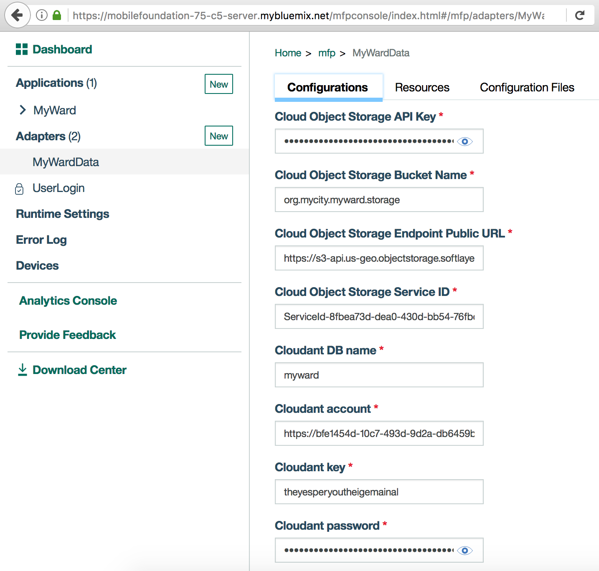

  * Click on `Resources` tab. You should see the various REST APIs exposed by `MyWardData` adapter as shown below. The `Security` column should show the protecting scope `UserLogin` against each REST method.

  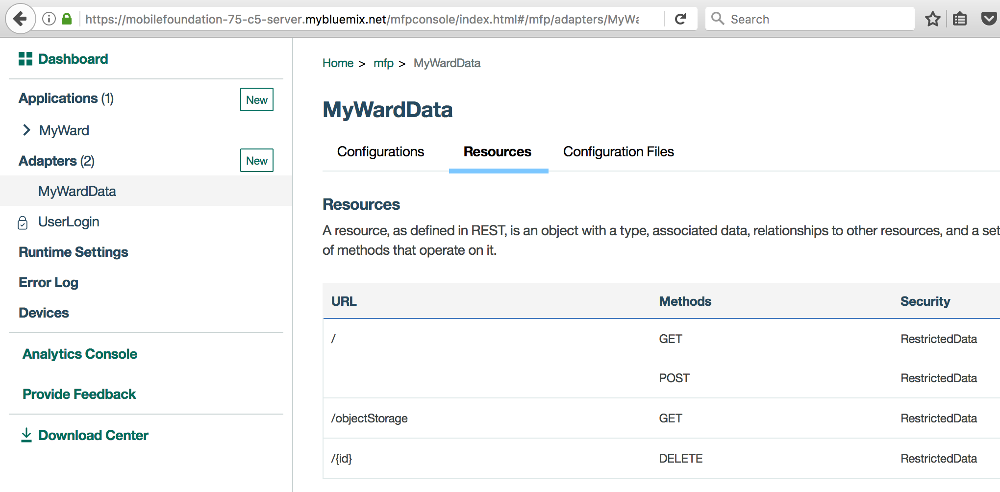

### 6.3 Test the MyWardData adapter

Create temporary credentials to test adapter REST API as below:
  * Inside the MFP dashboard, click on `Runtime Settings`. Click on `Confidential Clients`. Then click on `New`.
  * In the form that pops up, specify values for `ID` and `Secret` as shown in snapshot below. For `Allowed Scope` enter `**` and click on `Add`. Finally click on `Save`.

  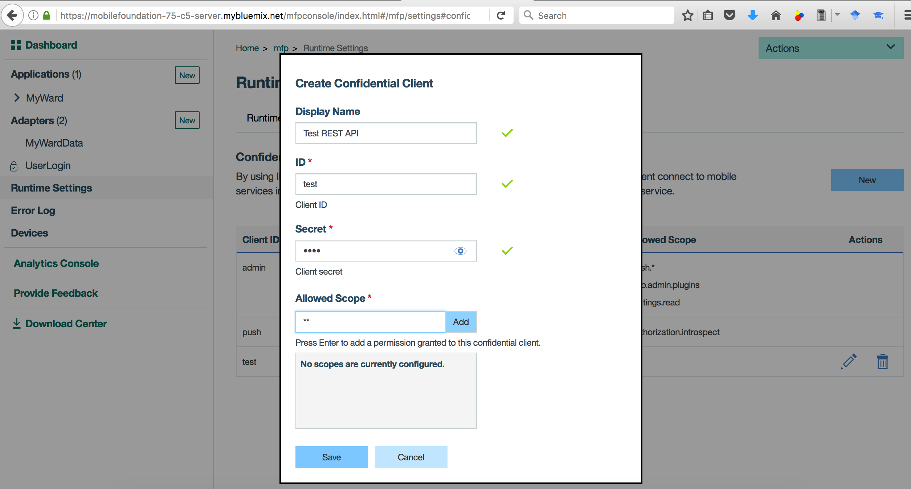

Test adapter REST API as below:
  * Inside the MFP dashboard, click on the `MyWardData` adapter. Click on `Resources` and then click on `View Swagger Docs`. The Swagger UI for adapter REST APIs will get shown in a new window/tab.
  * Inside the Swagger UI, click on `Expand Operations`.
  * To test the `GET /` API, first click on `OFF` toggle button to enable authentication. Select `Default Scope` and click on `Authorize` as shown below. Enter the `ID` and `Secret` created above against `Username` and `Password`. Click `OK`. If authentication is successful, the toggle button will switch to `ON` position.

  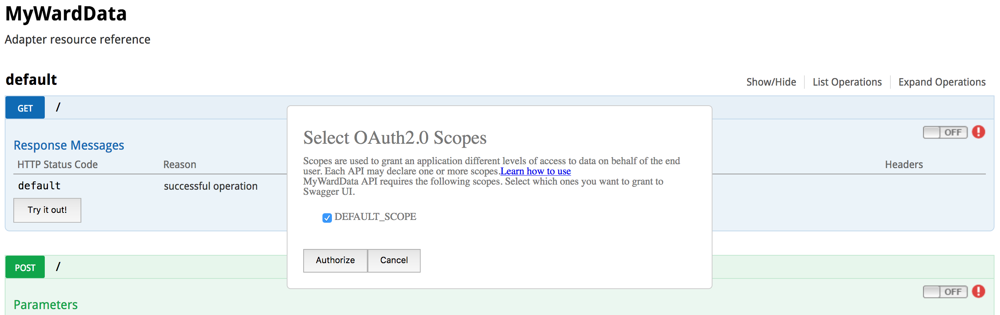

  * Now click on `Try it out` button to run the `GET /` API. The API response should get shown in the `Response Body` as shown in snapshot below.

  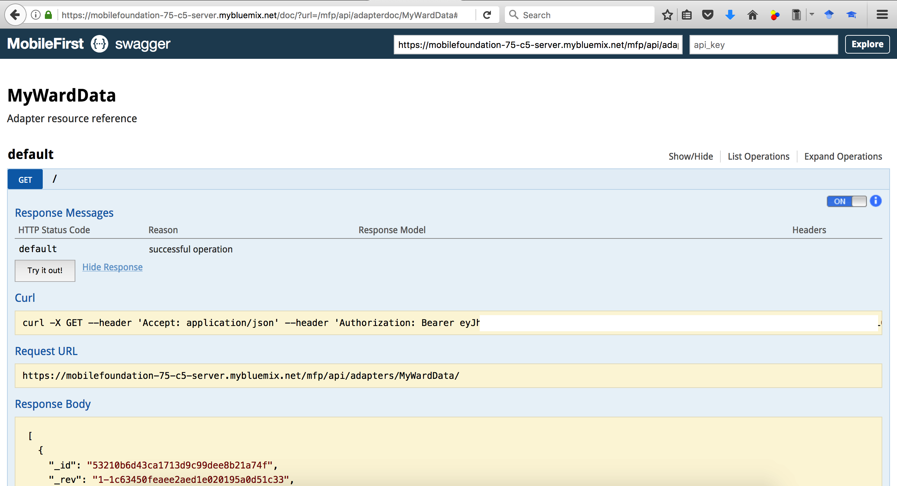

  * The GET API on `/objectStorage` should return a JSON object containing `baseUrl` and `authorizationHeader` as shown below.

  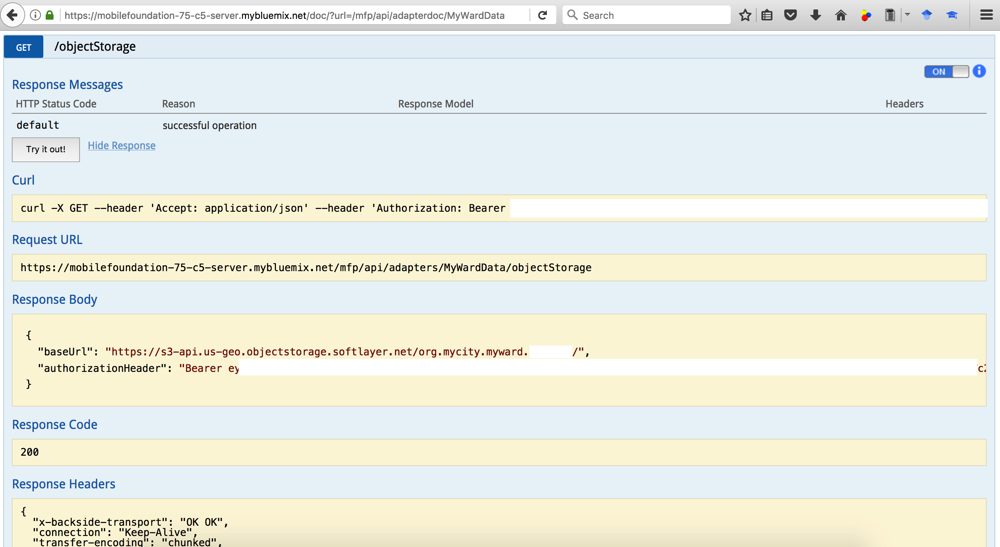

Delete the temporary credentials after testing adapter REST API as below:
  * Inside the MFP dashboard, click on `Runtime Settings`. Click on `Confidential Clients`.
  * Delete the `Client ID` created previously.

## Step 7. Run application on Android phone

### 7.1 Install Android Studio and Android SDK platform
* Download and install Android Studio from https://developer.android.com/studio/
* Install Android SDK Platform 23 (or higher) as below:
  - Launch Android Studio.
  - Click on `Configure` -> `SDK Manager`
  - Make a note of the `Android SDK Location`.
  - Under `SDK Platforms`, select `Android 6.0 (Marshmallow) API Level 23` or higher. Click `Apply` and then click `OK`. This will install Android SDK Platform on your machine.
* Edit `IonicMobileApp/config.xml` and specify the API level in `android-targetSdkVersion` as shown below.

<pre><code>
  &lt;preference name="android-minSdkVersion" value="16" /&gt;
  &lt;preference name="android-targetSdkVersion" <b>value="23"</b> /&gt;
</pre></code>

### 7.2 Enable developer options and USB debugging on your Android phone
* Enable USB debugging on your Android phone as per the steps in https://developer.android.com/studio/debug/dev-options
  - Launch the Settings app on your phone. Select `About Device` -> `Software Info`. Tap `Build number` 7 times to enable developer options.
  - Return to Settings list. Select `Developer options` and enable `USB debugging`.
* If you are developing on Windows, then you need to install the appropriate USB driver as per instructions in https://developer.android.com/studio/run/oem-usb.
* Connect the Android phone to your development machine by USB cable, and accept `allow` access on your phone.

### 7.3 Setup API keys for using Google Maps

* Get an API key for using the Google Maps Android API as per instructions in https://developers.google.com/maps/documentation/android-sdk/signup.

  You can similarly get an API key for using the Google Maps SDK for iOS as per instructions in
https://developers.google.com/maps/documentation/ios-sdk/get-api-key.

* Add the Google Maps API keys into the `MyWard` app as below:

```
$ cd ../../IonicMobileApp/
$ ionic cordova plugin add cordova-plugin-googlemaps --variable API_KEY_FOR_ANDROID="<Your_API_key_for_using_GoogleMaps_Android_API>" --variable API_KEY_FOR_IOS="<Your_API_key_for_using_GoogleMaps_SDK_for_iOS>" PLAY_SERVICES_VERSION=15.0.1
```

Note: Make sure you specify the latest PLAY_SERVICES_VERSION in the command above.

### 7.4 Enable Android platform for Ionic application

* Add [Cordova platform for Android](https://cordova.apache.org/docs/en/latest/guide/platforms/android/)
```
$ cd ../IonicMobileApp
$ ionic cordova platform add android@6.3.0
> cordova platform add android@6.3.0 --save
...
```

  Note: Make sure the Cordova platform version being added is supported by the MobileFirst plug-ins. Site https://mobilefirstplatform.ibmcloud.com/tutorials/en/foundation/8.0/application-development/sdk/cordova/ lists the supported levels.
```
$ cordova platform version
Installed platforms:
  android 6.3.0
Available platforms:
  blackberry10 ~3.8.0 (deprecated)
  browser ~4.1.0
  ios ~4.4.0
  osx ~4.0.1
  webos ~3.7.0
```

### 7.5 Register the MyWard app to MFP server

```
$ cd ../IonicMobileApp
$ mfpdev app register
Verifying server configuration...
Registering to server:'https://mobilefoundation-71-hb-server.mybluemix.net:443' runtime:'mfp'
Updated config.xml file located at: .../Ionic-MFP-App/IonicMobileApp/config.xml
Run 'cordova prepare' to propagate changes.
Registered app for platform: android
```

  Note: In [Step 4](#step-4-create-mobile-foundation-service-and-configure-mfp-cli), if you specified `No` to `Make this server the default?`, then you need to specify the name of your server profile (`Cloud-MFP` in our case) at the end of `mfpdev app register` command as shown below.
```
$ mfpdev app register Cloud-MFP
```

  Propagate changes by running `cordova prepare`
```
$ ionic cordova prepare
```

### 7.6 Build/Run the Ionic application on Android phone

* Build Android application
```
$ cd ../IonicMobileApp
$ ionic cordova build android
```

  Note: In case the Cordova build fails due to missing `ANDROID_HOME` and `JAVA_HOME` environment variables, then set those environment variables as per instructions in https://cordova.apache.org/docs/en/latest/guide/platforms/android/#setting-environment-variables. `ANDROID_HOME` should be set to the `Android SDK Location` that you noted in [Step 7.1](#71-install-android-studio-and-android-sdk-platform). Command `/usr/libexec/java_home` returns the value to be used for setting `JAVA_HOME` on [macOS](https://mattshomepage.com/articles/2016/May/22/java_home_mac_os_x/). On other platforms you could run `java -XshowSettings:properties 2>&1 | grep 'java.home'` as mentioned [here](http://sbndev.astro.umd.edu/wiki/Finding_and_Setting_JAVA_HOME#Sample_Perl_Script:_java_home).

* Run application on Android device
```
$ ionic cordova run android
```

  

  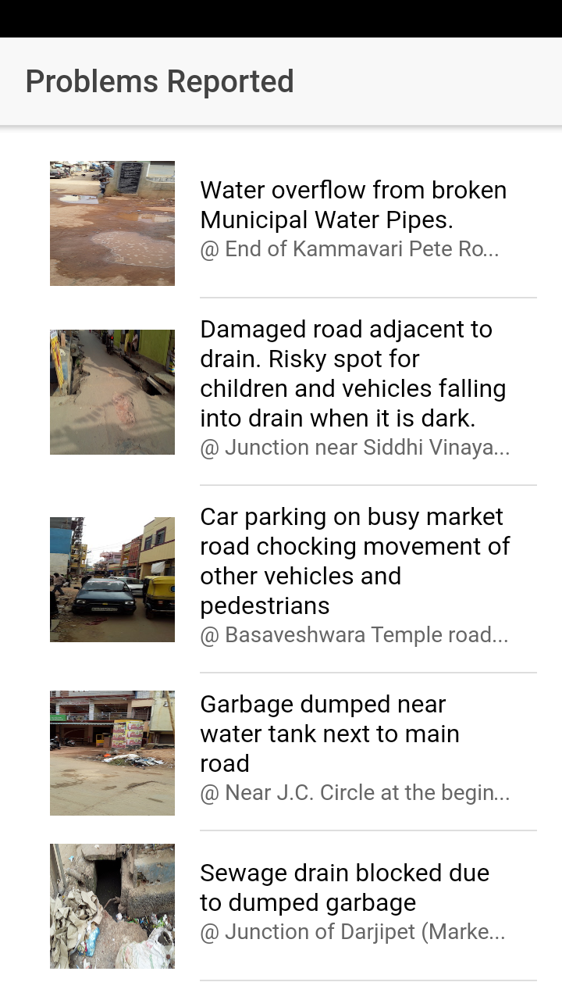  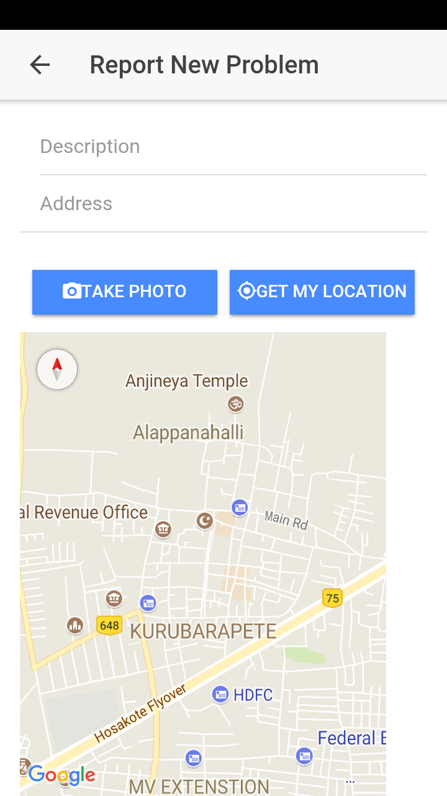


### 7.7 Update App Logo and Splash

Reference: Automating Icons and Splash Screens https://blog.ionicframework.com/automating-icons-and-splash-screens/

Copy your desired app icon to `IonicMobileApp/resources/icon.png` and app splash to `IonicMobileApp/resources/splash.png`.

```
$ cd ../IonicMobileApp
$ ionic cordova resources
```

For running `ionic cordova resources` command, you would need to sign up on [ionicframework.com](https://ionicframework.com/) and specify the credentials on the command line.

### 7.8 Build APK for uploading to Google Play Store

Reference: https://ionicframework.com/docs/intro/deploying/

* Add following lines at the end of `IonicMobileApp/platforms/android/proguard-project-mfp.txt`:
```
-dontwarn okhttp3.internal.huc.**
-keep class plugin.google.maps.** { *; }
```

* Create release build as below:
```
$ cd ../IonicMobileApp
$ ionic cordova build android --prod --release
```

* Set `ANDROID_HOME` environment variable as per instructions in [Step 7.6](#76-buildrun-the-ionic-application-on-android-phone). On Mac, this is usually:
```
export ANDROID_HOME=/Users/<username>/Library/Android/sdk
```

* Zip align release build as below:
```
$ cd ./platforms/android/build/outputs/apk/
$ ls
android-release-unsigned.apk
$ $ANDROID_HOME/build-tools/23.0.3/zipalign -v -p 4 android-release-unsigned.apk android-release-unsigned-aligned.apk
$ ls
android-release-unsigned-aligned.apk	android-release-unsigned.apk
```

* Create self signing certificate as below:

Make a note of the `Keystore password` that you set. You would need it for signing your APK.

```
$ keytool -genkey -v -keystore my-release-key.jks -keyalg RSA -keysize 2048 -validity 10000 -alias my-alias

Enter keystore password:
Re-enter new password:
What is your first and last name?
  [Unknown]:  Shiva Kumar H R
What is the name of your organizational unit?
  [Unknown]:  ISL
What is the name of your organization?
  [Unknown]:  IBM
What is the name of your City or Locality?
  [Unknown]:  Bangalore
What is the name of your State or Province?
  [Unknown]:  Karnataka
What is the two-letter country code for this unit?
  [Unknown]:  IN
Is CN=Shiva Kumar H R, OU=ISL, O=IBM, L=Bangalore, ST=Karnataka, C=IN correct?
  [no]:  yes

Generating 2,048 bit RSA key pair and self-signed certificate (SHA256withRSA) with a validity of 10,000 days
	for: CN=Shiva Kumar H R, OU=ISL, O=IBM, L=Bangalore, ST=Karnataka, C=IN
Enter key password for <my-alias>
	(RETURN if same as keystore password):
[Storing my-release-key.jks]

$ ls
android-release-unsigned-aligned.apk	android-release-unsigned.apk		my-release-key.jks
```

* Self sign APK as below:
```
$ $ANDROID_HOME/build-tools/23.0.3/apksigner sign --ks my-release-key.jks --out myward.apk android-release-unsigned-aligned.apk
Keystore password for signer #1:
$ ls
android-release-unsigned-aligned.apk	my-release-key.jks
android-release-unsigned.apk		myward.apk
$
```

* Distribute `myward.apk` by uploading to Google Play Store or to your company's internal App store.


# Troubleshooting

Please see [troubleshooting guide](TROUBLESHOOTING.md) for solutions to some commonly occuring problems.

### Debugging Android hybrid app using Chrome Developer Tools

* Install Google Chrome
* Open Google Chrome. Open URL chrome://inspect/#devices
* Under `Devices`, click on `inspect` below your connected device.

  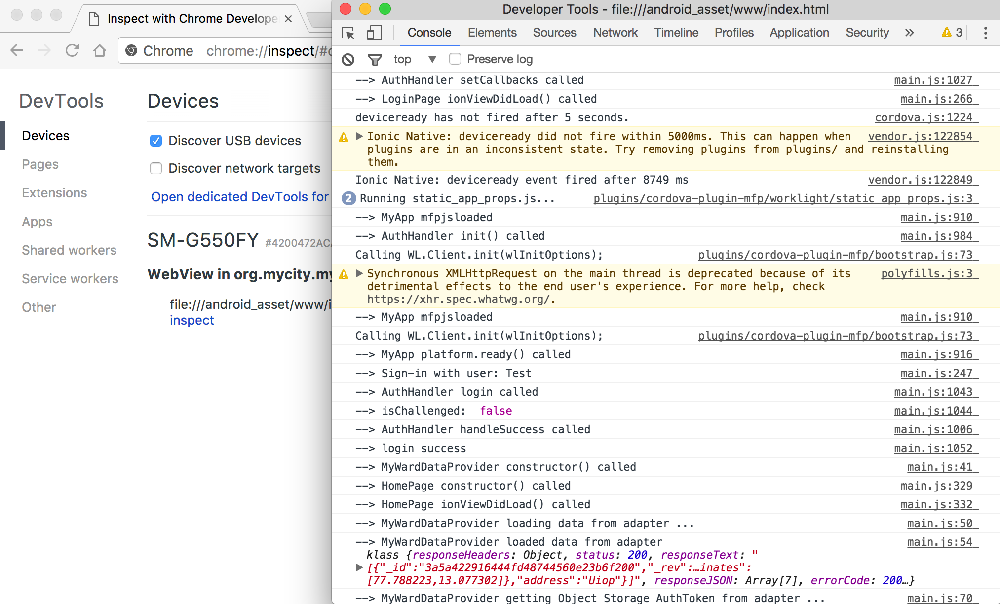


# References
* [Speeding up development of your enterprise mobile apps using open source technologies and cloud services](https://developer.ibm.com/code/2018/02/08/speeding-development-enterprise-mobile-apps-using-open-source-technologies-cloud-services/)
* [MobileFirst Foundation 8.0 Developer Labs](https://mobilefirstplatform.ibmcloud.com/labs/developers/8.0/intro/)
* Ionic 2 quick tutorials:
  - [10 Minutes with Ionic 2: Hello World](https://blog.ionicframework.com/10-minutes-with-ionic-2-hello-world/)
  - [10 Minutes with Ionic 2: Adding Pages and Navigation](https://blog.ionicframework.com/10-minutes-with-ionic-2-adding-pages-and-navigation/)
  - [10 Minutes with Ionic 2: Calling an API](https://blog.ionicframework.com/10-minutes-with-ionic-2-calling-an-api/)
  - [10 Minutes with Ionic 2: Using the Camera with Ionic Native](https://blog.ionicframework.com/10-minutes-with-ionic-2-using-the-camera-with-ionic-native/)
* [What Does Ionic 3 Mean for Ionic 2?](https://www.joshmorony.com/what-does-ionic-3-mean-for-ionic-2/)
* [Dealing with Asynchronous Code in Ionic](https://www.joshmorony.com/dealing-with-asynchronous-code-in-ionic/)
* [Understanding Zones and Change Detection in Ionic 2 & Angular 2](https://www.joshmorony.com/understanding-zones-and-change-detection-in-ionic-2-angular-2/)
* [Basic Security for Ionic & Cordova Applications](https://www.joshmorony.com/basic-security-for-ionic-cordova-applications/)

# License
This code pattern is licensed under the Apache Software License, Version 2.  Separate third party code objects invoked within this code pattern are licensed by their respective providers pursuant to their own separate licenses. Contributions are subject to the [Developer Certificate of Origin, Version 1.1 (DCO)](https://developercertificate.org/) and the [Apache Software License, Version 2](https://www.apache.org/licenses/LICENSE-2.0.txt).

[Apache Software License (ASL) FAQ](https://www.apache.org/foundation/license-faq.html#WhatDoesItMEAN)
