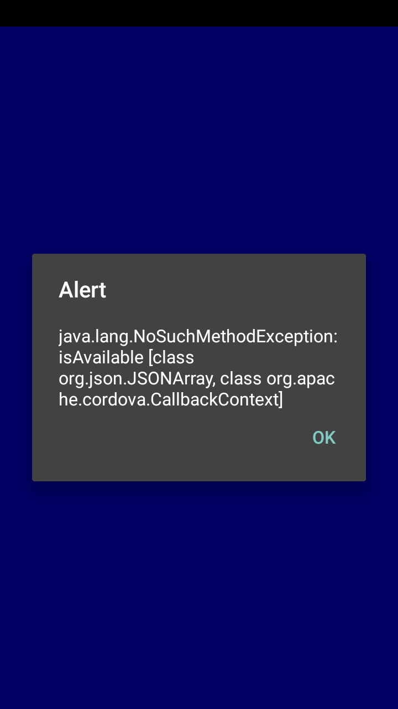

## Capturing logs from production version of the app on Android

### Use LogCat to see device logs

* [Set `ANDROID_HOME`](https://github.com/IBM/Ionic-MFP-App#76-buildrun-the-ionic-application-on-android-phone). On Mac, this is usually:
```
export ANDROID_HOME=/Users/<username>/Library/Android/sdk
```

* Launch Android Device Monitor as below:
```
$ cd $ANDROID_HOME/tools
$ ./monitor &
```

* Make sure you have [enabled developer options and USB debugging on your Android phone](https://github.com/IBM/Ionic-MFP-App#72-enable-developer-options-and-usb-debugging-on-your-android-phone). Connect your phone to your development machine.

* Select your device from `Devices` view.

* Click on `LogCat` view. All logs from device will get shown.

### See log messages of MyWard app only

* [Find PID](https://stackoverflow.com/questions/6854127/filter-logcat-to-get-only-the-messages-from-my-application-in-android) of MyWard app as below:
```
$ cd $ANDROID_HOME/platform-tools
$ ./adb shell ps|grep org.mycity.myward | cut -c10-15
 30067
```

* Filter log messages based on PID as below:
  - In `LogCat` view, click on the `+` button next to `Saved Filters`.
  - In the `LogCat Message Filter Settings` dialog, specify a name under `Filter Name`, and next to `by PID` specify the PID obtained above.
  - The new filter should get selected under `Saved Filters` and only the log messages specific to MyWard app should get shown in `LogCat` view.
  - To edit the PID at a later time, double click on your filter. This opens up the `LogCat Message Filter Settings` dialog and you can specify the new PID.

## Problems with production version of the app on Android

1) Problem:

`BUILD FAILED` error during Android release build.

```
$ ionic cordova build android --prod --release
...
BUILD FAILED
...
Error: .../Ionic-MFP-App/IonicMobileApp/platforms/android/gradlew: Command failed with exit code 1 Error output:
...
Warning: okhttp3.internal.huc.DelegatingHttpsURLConnection: can't find referenced class org.codehaus.mojo.animal_sniffer.IgnoreJRERequirement
Warning: okhttp3.internal.huc.DelegatingHttpsURLConnection: can't find referenced class org.codehaus.mojo.animal_sniffer.IgnoreJRERequirement
Warning: okhttp3.internal.huc.DelegatingHttpsURLConnection: can't find referenced class org.codehaus.mojo.animal_sniffer.IgnoreJRERequirement
Warning: okhttp3.internal.huc.OkHttpsURLConnection: can't find referenced class org.codehaus.mojo.animal_sniffer.IgnoreJRERequirement
Warning: okhttp3.internal.huc.OkHttpsURLConnection: can't find referenced class org.codehaus.mojo.animal_sniffer.IgnoreJRERequirement
Warning: okhttp3.internal.huc.OkHttpsURLConnection: can't find referenced class org.codehaus.mojo.animal_sniffer.IgnoreJRERequirement
Warning: there were 6 unresolved references to classes or interfaces.
         You may need to add missing library jars or update their versions.
         If your code works fine without the missing classes, you can suppress
         the warnings with '-dontwarn' options.
         (http://proguard.sourceforge.net/manual/troubleshooting.html#unresolvedclass)

FAILURE: Build failed with an exception.

* What went wrong:
Execution failed for task ':transformClassesAndResourcesWithProguardForRelease'.
...
[ERROR] An error occurred while running cordova build android --release (exit code 1).
```

Solution:

Make sure you have added following line at the end of `IonicMobileApp/platforms/android/proguard-project-mfp.txt`
```
-dontwarn okhttp3.internal.huc.**
```

2) Problem:

After installing the release APK, when the app is launched, an `Alert` with text 
`java.lang.NoSuchMethodException: isAvailable [class org.json.JSONArray, class org.apache.cordova.CallbackContext]` 
is thrown as shown below.



If you ignore the alert and continue to run the app, you will notice that in `Problem Detail` page, 
the problem location is not marked in Google Maps. Similarly in `Report New Problem` page, 
clicking on `GET MY LOCATION` will have no effect.

Solution:

Make sure you have added following line at the end of `IonicMobileApp/platforms/android/proguard-project-mfp.txt`
```
-keep class plugin.google.maps.** { *; }
```

Related problem report that helped resolve this problem: https://github.com/mapsplugin/cordova-plugin-googlemaps/issues/1152

3) Problem:

After installing the release APK and the app is launched for the first time, trying to click on `TAKE PHOTO` button in `Report New Problem` page, crashes the app with message `Unfortunately, MyWard has stopped`.

`LogCat` shows following errors:

```
...
 D/AndroidRuntime(25220): Shutting down VM
 E/AndroidRuntime(25220): FATAL EXCEPTION: main
 E/AndroidRuntime(25220): Process: org.mycity.myward, PID: 25220
 E/AndroidRuntime(25220): java.lang.RuntimeException: Failure delivering result ResultInfo{who=@android:requestPermissions:, request=1, result=-1, data=Intent { act=android.content.pm.action.REQUEST_PERMISSIONS (has extras) }} to activity {org.mycity.myward/org.mycity.myward.MainActivity}: java.lang.NullPointerException: Attempt to invoke virtual method 'android.content.res.XmlResourceParser android.content.pm.ProviderInfo.loadXmlMetaData(android.content.pm.PackageManager, java.lang.String)' on a null object reference
 E/AndroidRuntime(25220): 	at android.app.ActivityThread.deliverResults(ActivityThread.java:5032)
 E/AndroidRuntime(25220): 	at android.app.ActivityThread.handleSendResult(ActivityThread.java:5075)
 E/AndroidRuntime(25220): 	at android.app.ActivityThread.access$1600(ActivityThread.java:229)
 E/AndroidRuntime(25220): 	at android.app.ActivityThread$H.handleMessage(ActivityThread.java:1886)
 E/AndroidRuntime(25220): 	at android.os.Handler.dispatchMessage(Handler.java:102)
 E/AndroidRuntime(25220): 	at android.os.Looper.loop(Looper.java:148)
 E/AndroidRuntime(25220): 	at android.app.ActivityThread.main(ActivityThread.java:7402)
 E/AndroidRuntime(25220): 	at java.lang.reflect.Method.invoke(Native Method)
 E/AndroidRuntime(25220): 	at com.android.internal.os.ZygoteInit$MethodAndArgsCaller.run(ZygoteInit.java:1230)
 E/AndroidRuntime(25220): 	at com.android.internal.os.ZygoteInit.main(ZygoteInit.java:1120)
 E/AndroidRuntime(25220): Caused by: java.lang.NullPointerException: Attempt to invoke virtual method 'android.content.res.XmlResourceParser android.content.pm.ProviderInfo.loadXmlMetaData(android.content.pm.PackageManager, java.lang.String)' on a null object reference
 E/AndroidRuntime(25220): 	at android.support.v4.content.FileProvider.b(SourceFile:583)
 E/AndroidRuntime(25220): 	at android.support.v4.content.FileProvider.a(SourceFile:557)
 E/AndroidRuntime(25220): 	at android.support.v4.content.FileProvider.a(SourceFile:399)
 E/AndroidRuntime(25220): 	at org.apache.cordova.camera.CameraLauncher.takePicture(SourceFile:295)
 E/AndroidRuntime(25220): 	at org.apache.cordova.camera.CameraLauncher.onRequestPermissionResult(SourceFile:1315)
 E/AndroidRuntime(25220): 	at org.apache.cordova.CordovaInterfaceImpl.onRequestPermissionResult(SourceFile:214)
 E/AndroidRuntime(25220): 	at org.apache.cordova.CordovaActivity.onRequestPermissionsResult(SourceFile:508)
 E/AndroidRuntime(25220): 	at android.app.Activity.dispatchRequestPermissionsResult(Activity.java:7291)
 E/AndroidRuntime(25220): 	at android.app.Activity.dispatchActivityResult(Activity.java:7169)
 E/AndroidRuntime(25220): 	at android.app.ActivityThread.deliverResults(ActivityThread.java:5028)
 E/AndroidRuntime(25220): 	... 9 more
 E/com.worklight.common.a$f(25220): a$f.uncaughtException in SourceFile:449 :: Uncaught Exception
 E/com.worklight.common.a$f(25220): java.lang.RuntimeException: Failure delivering result ResultInfo{who=@android:requestPermissions:, request=1, result=-1, data=Intent { act=android.content.pm.action.REQUEST_PERMISSIONS (has extras) }} to activity {org.mycity.myward/org.mycity.myward.MainActivity}: java.lang.NullPointerException: Attempt to invoke virtual method 'android.content.res.XmlResourceParser android.content.pm.ProviderInfo.loadXmlMetaData(android.content.pm.PackageManager, java.lang.String)' on a null object reference
 E/com.worklight.common.a$f(25220): 	at android.app.ActivityThread.deliverResults(ActivityThread.java:5032)
 E/com.worklight.common.a$f(25220): 	at android.app.ActivityThread.handleSendResult(ActivityThread.java:5075)
 E/com.worklight.common.a$f(25220): 	at android.app.ActivityThread.access$1600(ActivityThread.java:229)
 E/com.worklight.common.a$f(25220): 	at android.app.ActivityThread$H.handleMessage(ActivityThread.java:1886)
 E/com.worklight.common.a$f(25220): 	at android.os.Handler.dispatchMessage(Handler.java:102)
 E/com.worklight.common.a$f(25220): 	at android.os.Looper.loop(Looper.java:148)
 E/com.worklight.common.a$f(25220): 	at android.app.ActivityThread.main(ActivityThread.java:7402)
 E/com.worklight.common.a$f(25220): 	at java.lang.reflect.Method.invoke(Native Method)
 E/com.worklight.common.a$f(25220): 	at com.android.internal.os.ZygoteInit$MethodAndArgsCaller.run(ZygoteInit.java:1230)
 E/com.worklight.common.a$f(25220): 	at com.android.internal.os.ZygoteInit.main(ZygoteInit.java:1120)
 E/com.worklight.common.a$f(25220): Caused by: java.lang.NullPointerException: Attempt to invoke virtual method 'android.content.res.XmlResourceParser android.content.pm.ProviderInfo.loadXmlMetaData(android.content.pm.PackageManager, java.lang.String)' on a null object reference
 E/com.worklight.common.a$f(25220): 	at android.support.v4.content.FileProvider.b(SourceFile:583)
 E/com.worklight.common.a$f(25220): 	at android.support.v4.content.FileProvider.a(SourceFile:557)
 E/com.worklight.common.a$f(25220): 	at android.support.v4.content.FileProvider.a(SourceFile:399)
 E/com.worklight.common.a$f(25220): 	at org.apache.cordova.camera.CameraLauncher.takePicture(SourceFile:295)
 E/com.worklight.common.a$f(25220): 	at org.apache.cordova.camera.CameraLauncher.onRequestPermissionResult(SourceFile:1315)
 E/com.worklight.common.a$f(25220): 	at org.apache.cordova.CordovaInterfaceImpl.onRequestPermissionResult(SourceFile:214)
 E/com.worklight.common.a$f(25220): 	at org.apache.cordova.CordovaActivity.onRequestPermissionsResult(SourceFile:508)
 E/com.worklight.common.a$f(25220): 	at android.app.Activity.dispatchRequestPermissionsResult(Activity.java:7291)
 E/com.worklight.common.a$f(25220): 	at android.app.Activity.dispatchActivityResult(Activity.java:7169)
 E/com.worklight.common.a$f(25220): 	at android.app.ActivityThread.deliverResults(ActivityThread.java:5028)
 E/com.worklight.common.a$f(25220): 	... 9 more
 W/CursorWrapperInner(25220): Cursor finalized without prior close()
 I/Process(25220): Sending signal. PID: 25220 SIG: 9
```

Reference: https://stackoverflow.com/questions/45938239/cordova-and-proguard-camera-plugin-npe-on-takepicture

Solution:

Edit `IonicMobileApp/config.xml` and add the following preference inside the `<platform name="android">` tag:
```
  <preference name="applicationId" value="org.mycity.myward" />
```

4) Problem:

`Application error. The connection to the server was unsuccessful` upon app launch on certain devices.

Reference: https://forum.ionicframework.com/t/application-error-the-connection-to-the-server-was-unsuccessful/67584

Solution:

Edit `IonicMobileApp/config.xml` and add/edit the following preference inside the `<platform name="android">` tag:
```
  <preference name="loadUrlTimeoutValue" value="60000" />
```

5) Problem:

Following warning during app build:

```
$ ionic cordova build android
...
Plugin doesn't support this project's cordova-plugman version. cordova-plugman: 8.0.0, failed version requirement: >=6.1.1 <8
Skipping 'cordova-plugin-mfp' for android.
...
```

If you ignore the above warning, and continue to run the app, then upon clicking `SIGN IN` in `Login` page, you will see following error in [Logs](https://github.com/IBM/Ionic-MFP-App/#debugging-android-hybrid-app-using-chrome-developer-tools):
```
vendor.js:1704 ERROR Error: Uncaught (in promise): ReferenceError: WLAuthorizationManager is not defined
ReferenceError: WLAuthorizationManager is not defined
    at AuthHandlerProvider.webpackJsonp.41.AuthHandlerProvider.login (main.js:1027)
    at main.js:1152
    at t.invoke (polyfills.js:3)
    at Object.onInvoke (vendor.js:4983)
    at t.invoke (polyfills.js:3)
    at r.run (polyfills.js:3)
    at polyfills.js:3
    at t.invokeTask (polyfills.js:3)
    at Object.onInvokeTask (vendor.js:4974)
    at t.invokeTask (polyfills.js:3)
```

Solution:

Downgrade your `cordova` version to one that is [supported by `cordova-plugin-mfp`](https://mobilefirstplatform.ibmcloud.com/tutorials/en/foundation/8.0/application-development/sdk/cordova/#support-levels).
```
$ npm view cordova versions --json
$ npm install -g cordova@7.0.1
```

Remove Cordova platform for Android and add it again. Then build and run the app.
```
$ ionic cordova platform remove android
$ ionic cordova platform add android@6.3.0
$ ionic cordova build android
$ ionic cordova run android
```

6) Problem:

Following runtime error when making a call to MobileFoundation adapter
```
Unhandled Promise rejection: Object {status: 400, statusText: "Bad Request", 
responseText: "{"errorCode":"invalid_request"}", responseJSON: Object, responseHeaders: Object…} ;
```

This is due to compatibility issues between the client SDKs and the MobileFoundation Server.

Reference: https://stackoverflow.com/questions/37806871/400-bad-request-in-wlauthorizationmanager-obtainaccesstoken-mfp8

Solution:
Make sure you are using latest version of cordova-plugin-mfp and recreate your MobileFoundation service instance if needed.

7) Problem:

In the `Report New Problem` page, when you click on `GET MY LOCATION` the app crashes with the following errors reported in [logs](#capturing-logs-from-production-version-of-the-app-on-android).
```
Rejecting re-init on previously-failed class java.lang.Class<android.support.v4.app.FragmentActivity>
Shutting down VM
 FATAL EXCEPTION: main
 Process: org.mycity.myward, PID: 19050
 java.lang.NoClassDefFoundError: android.support.v4.app.FragmentActivity
 	at com.google.android.gms.common.api.internal.zzce.zzajj(Unknown Source)
 	at com.google.android.gms.common.api.internal.LifecycleCallback.zzb(Unknown Source)
 	at com.google.android.gms.common.api.internal.LifecycleCallback.zzn(Unknown Source)
 	at com.google.android.gms.common.api.internal.zzah.zza(Unknown Source)
 	at com.google.android.gms.common.api.GoogleApi.<init>(Unknown Source)
 	at com.google.android.gms.common.api.GoogleApi.<init>(Unknown Source)
 	at com.google.android.gms.location.FusedLocationProviderClient.<init>(Unknown Source)
 	at com.google.android.gms.location.LocationServices.getFusedLocationProviderClient(Unknown Source)
 	at plugin.google.maps.PluginLocationService._requestLocationUpdate(PluginLocationService.java:451)
 	at plugin.google.maps.PluginLocationService.requestLocation(PluginLocationService.java:279)
 	at plugin.google.maps.PluginLocationService.access$300(PluginLocationService.java:39)
 	at plugin.google.maps.PluginLocationService$3.onConnected(PluginLocationService.java:234)
 	at com.google.android.gms.common.internal.zzae.zzk(Unknown Source)
 	at com.google.android.gms.common.api.internal.zzba.zzj(Unknown Source)
 	at com.google.android.gms.common.api.internal.zzao.zzaie(Unknown Source)
 	at com.google.android.gms.common.api.internal.zzao.onConnected(Unknown Source)
 	at com.google.android.gms.common.api.internal.zzbi.onConnected(Unknown Source)
 	at com.google.android.gms.common.api.internal.zzt.onConnected(Unknown Source)
 	at com.google.android.gms.common.internal.zzac.onConnected(Unknown Source)
 	at com.google.android.gms.common.internal.zzn.zzakr(Unknown Source)
 	at com.google.android.gms.common.internal.zze.zzw(Unknown Source)
 	at com.google.android.gms.common.internal.zzi.zzaks(Unknown Source)
 	at com.google.android.gms.common.internal.zzh.handleMessage(Unknown Source)
 	at android.os.Handler.dispatchMessage(Handler.java:102)
 	at android.os.Looper.loop(Looper.java:148)
 	at android.app.ActivityThread.main(ActivityThread.java:7402)
 	at java.lang.reflect.Method.invoke(Native Method)
 	at com.android.internal.os.ZygoteInit$MethodAndArgsCaller.run(ZygoteInit.java:1230)
 	at com.android.internal.os.ZygoteInit.main(ZygoteInit.java:1120)
```

Solution:
This is usually due to an incompatible configuration/version of Cordova plugin for GoogleMaps. Remove the plugin and add it again to resolve this problem.

```
$ cordova plugin remove cordova-plugin-googlemaps
$ cordova plugin add cordova-plugin-googlemaps --variable API_KEY_FOR_ANDROID=“your-api-key-for-android”
```

Remove Android platform and add it again to pickup the changes.
```
$ ionic cordova platform remove android
$ ionic cordova platform add android@6.3.0
$ ionic cordova run android
```
